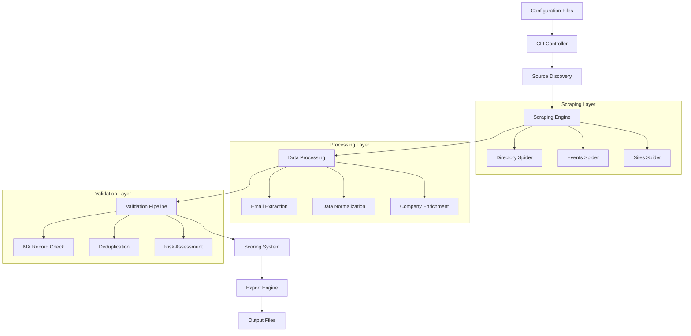

# Advanced OSINT B2B Email List Generation System
## Comprehensive Technical Documentation

### Version 1.0
### Date: 2025-01-19
### Compliance: GDPR/ePrivacy/CAN-SPAM

---

## Table of Contents

1. [Executive Summary](#executive-summary)
2. [System Architecture](#system-architecture)
3. [Compliance Framework](#compliance-framework)
4. [Configuration Parameters](#configuration-parameters)
5. [Automated Scraping Workflows](#automated-scraping-workflows)
6. [Data Validation & Verification](#data-validation--verification)
7. [Negative Filtering Mechanisms](#negative-filtering-mechanisms)
8. [Output Optimization](#output-optimization)
9. [Implementation Guide](#implementation-guide)
10. [API Integrations](#api-integrations)
11. [Scalability & Performance](#scalability--performance)
12. [Maintenance & Operations](#maintenance--operations)
13. [Setup Instructions](#setup-instructions)
14. [Usage Examples](#usage-examples)
15. [Troubleshooting & FAQ](#troubleshooting--faq)

---

## Executive Summary

The Advanced OSINT B2B Email List Generation System is a next-generation, GDPR-compliant platform designed to ethically collect and validate business email addresses from publicly available sources. The system leverages cutting-edge web scraping technologies, intelligent data processing, and comprehensive validation mechanisms to generate high-quality B2B email lists with minimal manual intervention.

### Key Features
- **100% Legal Compliance**: Full adherence to GDPR, ePrivacy, and CAN-SPAM regulations
- **Massive Scale**: Capable of processing 20,000+ records with intelligent rate limiting
- **Minimal Manual Effort**: Fully automated workflows with intelligent source discovery
- **High-Quality Output**: Advanced scoring algorithms and validation mechanisms
- **Ethical Harvesting**: Respects robots.txt, implements proper delays, and focuses on business roles only

### Core Technologies
- **Web Scraping**: Scrapy framework with Playwright for JavaScript-heavy sites
- **Data Processing**: Python 3.11+ with pandas and pydantic for data validation
- **Email Verification**: DNS MX record validation with optional SMTP probing
- **Storage**: SQLite for caching, with CSV/JSONL for output formats
- **CLI Interface**: Typer-based command-line interface for operational control

---

## System Architecture

### High-Level Architecture



### Component Architecture

#### 1. Scraping Infrastructure
- **Framework**: Scrapy 2.11+ with asyncio support
- **JavaScript Rendering**: Playwright for SPA and dynamic content
- **Rate Limiting**: Intelligent autothrottle with exponential backoff
- **User Agent Rotation**: Dynamic UA switching to avoid detection
- **Proxy Support**: Optional proxy rotation for large-scale operations

#### 2. Data Processing Pipeline
- **Email Extraction**: Regex-based role identification with context analysis
- **Normalization**: Domain standardization, company name matching
- **Enrichment**: Technology fingerprinting and company size estimation
- **Validation**: Multi-layer validation including MX records and pattern matching

#### 3. Storage Layer
- **Caching**: SQLite database for intermediate data storage
- **Deduplication**: Hash-based duplicate detection across sources
- **Audit Trail**: Complete provenance tracking for compliance

---

## Compliance Framework

### GDPR Compliance

#### Legal Basis: Legitimate Interest (Article 6(1)(f))
- **Purpose**: B2B marketing and lead generation
- **Balancing Test**: Business necessity vs. individual privacy rights
- **Documentation**: Comprehensive audit logs for all processing activities

#### Data Subject Rights
- **Right to Information**: Clear privacy notice in all outreach
- **Right of Access**: Ability to provide data source upon request
- **Right to Rectification**: Correction mechanisms for inaccurate data
- **Right to Erasure**: Immediate removal from lists upon request
- **Right to Object**: One-click opt-out in all communications

#### Technical and Organizational Measures
```yaml
data_protection:
  encryption_at_rest: AES-256
  access_controls: role_based
  audit_logging: comprehensive
  data_retention: 24_months_max
  deletion_schedule: automated
  breach_notification: 72_hours
```

### ePrivacy Directive Compliance

#### Electronic Communications
- **Consent**: Not required for B2B legitimate interest
- **Opt-out**: Mandatory unsubscribe mechanism
- **Identification**: Clear sender identification
- **Subject Lines**: Non-deceptive email subjects

#### Cookie Usage
- **Session Cookies**: Technical necessity only
- **Analytics**: Anonymized data collection
- **Tracking**: Minimal fingerprinting for fraud prevention

### CAN-SPAM Compliance

#### Requirements Checklist
- [x] **Clear Sender Identity**: Business name and contact information
- [x] **Truthful Subject Lines**: No deceptive headlines
- [x] **Advertisement Disclosure**: Clear identification of promotional content
- [x] **Physical Address**: Valid postal address inclusion
- [x] **Unsubscribe Mechanism**: One-click opt-out within 10 business days
- [x] **Honor Opt-outs**: Immediate processing of unsubscribe requests

---

## Configuration Parameters

### Primary Configuration Structure

```yaml
# configs/personas.yml
personas:
  technical_decision_makers:
    roles: ["CTO", "Tech Lead", "VP Engineering", "Head of Technology"]
    email_patterns: ["cto@", "tech@", "engineering@", "dev@"]
    negative_signals: ["intern", "junior", "assistant"]
    scoring_weight: 35

  operations_leaders:
    roles: ["COO", "Operations Manager", "Head of Operations"]
    email_patterns: ["ops@", "operations@", "coo@"]
    negative_signals: ["coordinator", "assistant"]
    scoring_weight: 30

  procurement_specialists:
    roles: ["Procurement", "Purchasing", "Buyer", "Supply Chain"]
    email_patterns: ["procurement@", "purchasing@", "buyer@"]
    negative_signals: ["assistant", "clerk"]
    scoring_weight: 25
```

### Geographic Targeting

```yaml
# configs/geography.yml
target_regions:
  nordics:
    countries: ["NO", "SE", "DK", "FI", "IS"]
    languages: ["nb", "sv", "da", "fi", "is", "en"]
    tld_preferences: [".no", ".se", ".dk", ".fi", ".is"]
    scoring_boost: 20

  dach:
    countries: ["DE", "AT", "CH"]
    languages: ["de", "en"]
    tld_preferences: [".de", ".at", ".ch"]
    scoring_boost: 15

  eu_core:
    countries: ["FR", "NL", "BE", "LU", "IE"]
    languages: ["fr", "nl", "en"]
    tld_preferences: [".fr", ".nl", ".be", ".eu"]
    scoring_boost: 10
```

### Sector Categorization

```yaml
# configs/sectors.yml
sectors:
  technology:
    keywords: ["SaaS", "software", "tech", "digital", "cloud", "AI"]
    negative_keywords: ["hardware", "manufacturing"]
    size_indicators: ["startup", "scale-up", "enterprise"]
    scoring_multiplier: 1.5

  ecommerce:
    keywords: ["e-commerce", "retail", "online store", "webshop"]
    technology_signals: ["Shopify", "WooCommerce", "Magento"]
    size_indicators: ["GMV", "orders", "customers"]
    scoring_multiplier: 1.3

  manufacturing:
    keywords: ["manufacturing", "production", "industrial"]
    exclusions: ["retail", "service"]
    size_indicators: ["employees", "facilities", "revenue"]
    scoring_multiplier: 1.0
```

### Company Size Parameters

```yaml
# configs/company_size.yml
size_categories:
  startup:
    employee_range: [1, 50]
    revenue_indicators: ["pre-revenue", "seed", "series A"]
    scoring_adjustment: -0.1

  scale_up:
    employee_range: [51, 250]
    revenue_indicators: ["series B", "series C", "growth"]
    scoring_adjustment: 0.0

  mid_market:
    employee_range: [251, 1000]
    revenue_indicators: ["established", "profitable"]
    scoring_adjustment: 0.1

  enterprise:
    employee_range: [1001, 999999]
    revenue_indicators: ["public", "fortune", "global"]
    scoring_adjustment: 0.2
```

---

## Automated Scraping Workflows

### Source Discovery Engine

#### Primary Source Categories

1. **Business Directories**
   - Industry-specific catalogs
   - Chamber of Commerce listings
   - Professional association directories
   - Government business registries

2. **Event Platforms**
   - Conference exhibitor lists
   - Trade show participants
   - Webinar attendee directories
   - Professional networking events

3. **Corporate Websites**
   - About Us pages
   - Contact pages
   - Press release sections
   - Team directories

### Scraping Strategy Matrix

```python
# scraping/strategies.py
SCRAPING_STRATEGIES = {
    "static_html": {
        "tool": "scrapy",
        "concurrent_requests": 16,
        "download_delay": (1, 3),  # Random between 1-3 seconds
        "autothrottle": True
    },

    "javascript_heavy": {
        "tool": "playwright",
        "concurrent_requests": 4,
        "page_timeout": 30000,
        "wait_for_selector": True
    },

    "rate_limited": {
        "tool": "scrapy",
        "concurrent_requests": 2,
        "download_delay": (5, 10),
        "retry_times": 3
    }
}
```

### Workflow Implementation

#### 1. Source Seeding
```python
def generate_search_queries(persona, sector, geography):
    """Generate targeted search queries for source discovery."""
    base_queries = [
        f'site:linkedin.com/company {sector} {geography} employees',
        f'"{persona}" AND "{sector}" AND contact',
        f'intitle:"{sector} directory" {geography}',
        f'filetype:pdf "{sector} exhibitors" {geography}'
    ]

    # Advanced Google dorks for specific sectors
    sector_specific = {
        'technology': [
            'inurl:about-us "CTO" OR "technology"',
            f'site:crunchbase.com {geography} tech startup'
        ],
        'ecommerce': [
            f'powered by shopify {geography}',
            'inurl:contact "e-commerce" OR "online store"'
        ]
    }

    return base_queries + sector_specific.get(sector, [])
```

#### 2. Intelligent Crawling
```python
class AdaptiveSpider(scrapy.Spider):
    """Self-adapting spider with intelligent rate limiting."""

    def __init__(self):
        self.success_rate = 0.0
        self.response_times = []
        self.current_delay = 1.0

    def adjust_crawl_rate(self, response):
        """Dynamically adjust crawling speed based on server response."""
        if response.status == 429:  # Rate limited
            self.current_delay *= 2
        elif response.status == 200:
            if len(self.response_times) > 10:
                avg_response_time = sum(self.response_times[-10:]) / 10
                if avg_response_time < 1.0:  # Fast responses
                    self.current_delay = max(0.5, self.current_delay * 0.9)
```

### Content Extraction Patterns

#### Email Pattern Recognition
```python
import re
from typing import List, Tuple

ROLE_EMAIL_PATTERNS = {
    'executive': re.compile(r'\b(ceo|cto|cfo|coo|president|director)@[a-zA-Z0-9.-]+\.[a-zA-Z]{2,}\b', re.IGNORECASE),
    'technical': re.compile(r'\b(tech|engineering|dev|it|systems)@[a-zA-Z0-9.-]+\.[a-zA-Z]{2,}\b', re.IGNORECASE),
    'operations': re.compile(r'\b(ops|operations|admin|office)@[a-zA-Z0-9.-]+\.[a-zA-Z]{2,}\b', re.IGNORECASE),
    'sales': re.compile(r'\b(sales|business|commercial|partnerships)@[a-zA-Z0-9.-]+\.[a-zA-Z]{2,}\b', re.IGNORECASE),
    'support': re.compile(r'\b(support|help|service|contact)@[a-zA-Z0-9.-]+\.[a-zA-Z]{2,}\b', re.IGNORECASE)
}

def extract_contextual_emails(html_content: str, url: str) -> List[Tuple[str, str, str]]:
    """Extract emails with surrounding context for role determination."""
    results = []

    for role_type, pattern in ROLE_EMAIL_PATTERNS.items():
        matches = pattern.finditer(html_content)
        for match in matches:
            email = match.group()
            start_pos = max(0, match.start() - 200)
            end_pos = min(len(html_content), match.end() + 200)
            context = html_content[start_pos:end_pos]

            results.append((email, role_type, context))

    return results
```

---

## Data Validation & Verification

### Multi-Layer Validation Pipeline

#### Layer 1: Format Validation
```python
import re
from typing import Dict, Any

def validate_email_format(email: str) -> Dict[str, Any]:
    """Comprehensive email format validation."""

    # RFC 5322 compliant regex (simplified)
    rfc5322_pattern = re.compile(
        r"^[a-zA-Z0-9.!#$%&'*+/=?^_`{|}~-]+@[a-zA-Z0-9](?:[a-zA-Z0-9-]{0,61}[a-zA-Z0-9])?(?:\.[a-zA-Z0-9](?:[a-zA-Z0-9-]{0,61}[a-zA-Z0-9])?)*$"
    )

    validation_result = {
        'is_valid': bool(rfc5322_pattern.match(email)),
        'has_valid_tld': False,
        'is_role_based': False,
        'risk_score': 0
    }

    if '@' in email:
        local, domain = email.split('@', 1)

        # Check for valid TLD
        if '.' in domain:
            tld = domain.split('.')[-1]
            validation_result['has_valid_tld'] = len(tld) >= 2

        # Role-based email detection
        role_indicators = ['info', 'contact', 'sales', 'support', 'admin']
        validation_result['is_role_based'] = local.lower() in role_indicators

    return validation_result
```

#### Layer 2: MX Record Validation
```python
import dns.resolver
from typing import Optional

def validate_mx_record(domain: str) -> Dict[str, Any]:
    """Validate domain MX records for deliverability."""

    try:
        mx_records = dns.resolver.resolve(domain, 'MX')

        return {
            'has_mx': True,
            'mx_count': len(mx_records),
            'primary_mx': str(mx_records[0]).split()[-1],
            'deliverability_score': min(100, len(mx_records) * 20)
        }

    except dns.resolver.NXDOMAIN:
        return {'has_mx': False, 'error': 'Domain not found'}
    except dns.resolver.NoAnswer:
        return {'has_mx': False, 'error': 'No MX records'}
    except Exception as e:
        return {'has_mx': False, 'error': str(e)}
```

#### Layer 3: SMTP Validation (Optional)
```python
import smtplib
import socket
from typing import Dict, Any

def validate_smtp_deliverability(email: str, timeout: int = 10) -> Dict[str, Any]:
    """Optional SMTP validation without sending emails."""

    domain = email.split('@')[1]

    try:
        # Get MX record
        mx_records = dns.resolver.resolve(domain, 'MX')
        mx_server = str(mx_records[0]).split()[-1].rstrip('.')

        # Connect to SMTP server
        with smtplib.SMTP(mx_server, 25, timeout=timeout) as server:
            server.helo()
            server.mail('test@example.com')  # Sender
            code, message = server.rcpt(email)  # Recipient

            return {
                'smtp_valid': code == 250,
                'smtp_code': code,
                'smtp_message': message.decode() if isinstance(message, bytes) else message
            }

    except Exception as e:
        return {'smtp_valid': False, 'error': str(e)}
```

### Deduplication Strategy

#### Hash-Based Deduplication
```python
import hashlib
from typing import Set, List, Dict

class EmailDeduplicator:
    """Advanced deduplication with similarity matching."""

    def __init__(self):
        self.email_hashes: Set[str] = set()
        self.domain_role_hashes: Set[str] = set()

    def generate_email_hash(self, email: str) -> str:
        """Generate normalized hash for exact email matching."""
        normalized = email.lower().strip()
        return hashlib.md5(normalized.encode()).hexdigest()

    def generate_domain_role_hash(self, email: str, role: str) -> str:
        """Generate hash for domain+role combination."""
        domain = email.split('@')[1].lower()
        role_normalized = role.lower().strip()
        combined = f"{domain}:{role_normalized}"
        return hashlib.md5(combined.encode()).hexdigest()

    def is_duplicate(self, email: str, role: str) -> bool:
        """Check if email or domain+role combination is duplicate."""
        email_hash = self.generate_email_hash(email)
        domain_role_hash = self.generate_domain_role_hash(email, role)

        if email_hash in self.email_hashes:
            return True

        if domain_role_hash in self.domain_role_hashes:
            return True

        # Add to tracking sets
        self.email_hashes.add(email_hash)
        self.domain_role_hashes.add(domain_role_hash)

        return False
```

---

## Negative Filtering Mechanisms

### Multi-Tier Filtering System

#### Tier 1: Email Pattern Exclusions
```python
NEGATIVE_EMAIL_PATTERNS = [
    # Personal email patterns
    re.compile(r'\b[a-z]+\.[a-z]+@'),  # firstname.lastname
    re.compile(r'\b[a-z]+[0-9]+@'),    # name+numbers

    # Non-business roles
    re.compile(r'\b(no-reply|noreply|donotreply)@', re.IGNORECASE),
    re.compile(r'\b(marketing|newsletter|spam)@', re.IGNORECASE),

    # Educational/government exclusions
    re.compile(r'@.*\.edu$', re.IGNORECASE),
    re.compile(r'@.*\.gov$', re.IGNORECASE),

    # Temporary/disposable patterns
    re.compile(r'@(10minutemail|tempmail|guerrillamail)', re.IGNORECASE)
]

def apply_negative_email_filters(email: str) -> Dict[str, Any]:
    """Apply negative filtering patterns to email."""

    filter_results = {
        'passed_filters': True,
        'failed_filters': [],
        'risk_score': 0
    }

    for i, pattern in enumerate(NEGATIVE_EMAIL_PATTERNS):
        if pattern.search(email):
            filter_results['passed_filters'] = False
            filter_results['failed_filters'].append(f'pattern_{i}')
            filter_results['risk_score'] += 10

    return filter_results
```

#### Tier 2: Domain Blacklisting
```python
DOMAIN_BLACKLIST = {
    # Consumer email providers
    'consumer_email': [
        'gmail.com', 'yahoo.com', 'hotmail.com', 'outlook.com',
        'aol.com', 'icloud.com', 'protonmail.com'
    ],

    # Educational institutions
    'educational': [
        '.edu', '.ac.uk', '.edu.au', '.ac.in'
    ],

    # Government domains
    'government': [
        '.gov', '.gov.uk', '.gouv.fr', '.gob.es'
    ],

    # Healthcare/medical
    'healthcare': [
        'hospital.com', 'clinic.com', '.nhs.uk'
    ],

    # Non-profit organizations
    'nonprofit': [
        '.org', '.charity', '.foundation'
    ]
}

def check_domain_blacklist(email: str) -> Dict[str, Any]:
    """Check email domain against blacklist categories."""

    domain = email.split('@')[1].lower()

    blacklist_result = {
        'is_blacklisted': False,
        'blacklist_category': None,
        'risk_increase': 0
    }

    for category, domains in DOMAIN_BLACKLIST.items():
        for blacklisted_domain in domains:
            if domain.endswith(blacklisted_domain):
                blacklist_result['is_blacklisted'] = True
                blacklist_result['blacklist_category'] = category
                blacklist_result['risk_increase'] = 50
                break

        if blacklist_result['is_blacklisted']:
            break

    return blacklist_result
```

#### Tier 3: Content-Based Filtering
```python
def analyze_surrounding_context(context: str, email: str) -> Dict[str, Any]:
    """Analyze surrounding context for business relevance."""

    # Business context indicators
    business_indicators = [
        'company', 'corporation', 'business', 'enterprise',
        'office', 'headquarters', 'branch', 'division'
    ]

    # Personal context indicators (negative)
    personal_indicators = [
        'personal', 'private', 'home', 'family',
        'individual', 'freelance', 'consultant'
    ]

    context_lower = context.lower()

    business_score = sum(1 for indicator in business_indicators if indicator in context_lower)
    personal_score = sum(1 for indicator in personal_indicators if indicator in context_lower)

    return {
        'business_context_score': business_score,
        'personal_context_score': personal_score,
        'context_relevance': business_score - personal_score,
        'recommended_inclusion': business_score > personal_score
    }
```

---

## Output Optimization

### Intelligent Scoring Algorithm

#### Multi-Factor Scoring System
```python
class EmailScorer:
    """Advanced scoring system for email lead quality."""

    def __init__(self, config: Dict[str, Any]):
        self.weights = config.get('scoring_weights', {
            'persona_match': 0.35,
            'sector_relevance': 0.20,
            'geographic_preference': 0.20,
            'source_credibility': 0.15,
            'data_freshness': 0.10
        })

    def calculate_persona_score(self, email: str, role: str, persona_config: Dict) -> float:
        """Score based on persona matching."""

        target_roles = persona_config.get('roles', [])
        email_patterns = persona_config.get('email_patterns', [])
        negative_signals = persona_config.get('negative_signals', [])

        score = 0.0

        # Direct role match
        if any(target_role.lower() in role.lower() for target_role in target_roles):
            score += 0.8

        # Email pattern match
        local_part = email.split('@')[0].lower()
        if any(pattern.replace('@', '') in local_part for pattern in email_patterns):
            score += 0.6

        # Negative signal penalty
        if any(signal.lower() in role.lower() for signal in negative_signals):
            score -= 0.5

        return max(0.0, min(1.0, score))

    def calculate_sector_score(self, company_info: Dict, sector_config: Dict) -> float:
        """Score based on sector matching."""

        company_description = company_info.get('description', '').lower()
        sector_keywords = sector_config.get('keywords', [])
        negative_keywords = sector_config.get('negative_keywords', [])

        keyword_matches = sum(1 for keyword in sector_keywords if keyword.lower() in company_description)
        negative_matches = sum(1 for keyword in negative_keywords if keyword.lower() in company_description)

        base_score = min(1.0, keyword_matches * 0.3)
        penalty = negative_matches * 0.2

        return max(0.0, base_score - penalty)

    def calculate_final_score(self, lead_data: Dict) -> float:
        """Calculate weighted final score."""

        scores = {
            'persona': self.calculate_persona_score(
                lead_data['email'],
                lead_data['role'],
                lead_data['persona_config']
            ),
            'sector': self.calculate_sector_score(
                lead_data['company_info'],
                lead_data['sector_config']
            ),
            'geographic': lead_data.get('geographic_score', 0.5),
            'source': lead_data.get('source_credibility', 0.5),
            'freshness': lead_data.get('freshness_score', 0.5)
        }

        # Calculate weighted score using cleaner mapping
        weight_mapping = {
            'persona': 'persona_match',
            'sector': 'sector_relevance',
            'geographic': 'geographic_preference',
            'source': 'source_credibility',
            'freshness': 'data_freshness'
        }

        weighted_score = sum(
            scores[factor] * self.weights[weight_mapping[factor]]
            for factor in scores
        )

        return round(weighted_score * 100, 2)  # Scale to 0-100
```

### Export Format Specifications

#### CSV Output Structure
```python
CSV_COLUMNS = [
    'email',                # Primary email address
    'role',                 # Extracted role/title
    'domain',               # Company domain
    'company',              # Company name
    'country',              # ISO country code
    'size_hint',            # Estimated company size
    'tech_signals',         # Technology indicators
    'source_url',           # Original source URL
    'source_type',          # Source category
    'retrieved_at',         # UTC timestamp
    'verification_status',   # Email verification status
    'score',                # Quality score (0-100)
    'contact_context',      # Surrounding context
    'compliance_notes'      # Legal basis and opt-out info
]
```

#### JSONL Output Schema
```python
JSONL_SCHEMA = {
    "lead": {
        "email": "string",
        "role": "string",
        "confidence": "float"  # 0.0-1.0
    },
    "company": {
        "name": "string",
        "domain": "string",
        "size_category": "string",
        "industry": "string",
        "country": "string",
        "technologies": ["array of strings"]
    },
    "source": {
        "url": "string",
        "type": "string",
        "credibility_score": "float",
        "retrieved_at": "ISO8601 datetime"
    },
    "validation": {
        "email_format": "boolean",
        "mx_record": "boolean",
        "deliverability_score": "integer",
        "risk_assessment": "string"
    },
    "scoring": {
        "total_score": "integer",  # 0-100
        "factor_scores": {
            "persona_match": "float",
            "sector_relevance": "float",
            "geographic_preference": "float",
            "source_credibility": "float",
            "data_freshness": "float"
        }
    },
    "compliance": {
        "legal_basis": "string",
        "collection_purpose": "string",
        "opt_out_available": "boolean",
        "privacy_policy_url": "string"
    }
}
```

---

## Implementation Guide

### Project Structure Setup

```
osint-lists/
├── scraping/
│   ├── __init__.py
│   ├── spiders/
│   │   ├── __init__.py
│   │   ├── directories_spider.py
│   │   ├── events_spider.py
│   │   └── sites_spider.py
│   ├── settings.py
│   ├── pipelines.py
│   └── middlewares.py
├── extract/
│   ├── __init__.py
│   ├── email_rules.py
│   └── normalize.py
├── enrich/
│   ├── __init__.py
│   ├── tech_fingerprint.py
│   └── company_enrich.py
├── validate/
│   ├── __init__.py
│   ├── mx_check.py
│   ├── dedupe.py
│   └── risk.py
├── scoring/
│   ├── __init__.py
│   └── score.py
├── export/
│   ├── __init__.py
│   └── write_outputs.py
├── report/
│   ├── __init__.py
│   └── summary.md.j2
├── configs/
│   ├── personas.yml
│   ├── sources.yml
│   └── rules.yml
├── notebooks/
│   └── analysis.ipynb
├── tests/
│   ├── test_email_rules.py
│   ├── test_validation.py
│   └── test_scoring.py
├── cli.py
├── requirements.txt
├── README.md
├── .env.example
├── .gitignore
└── LICENSE
```

### Core Implementation Examples

#### Scrapy Spider Implementation
```python
# scraping/spiders/directories_spider.py
import scrapy
from scrapy_playwright.page import PageMethod
import json

class DirectoriesSpider(scrapy.Spider):
    name = 'directories'

    def __init__(self, sources_config=None, *args, **kwargs):
        super().__init__(*args, **kwargs)
        self.sources_config = sources_config or {}

    def start_requests(self):
        """Generate initial requests from source configuration."""

        directory_sources = self.sources_config.get('directories', [])

        for source in directory_sources:
            if source.get('type') == 'static':
                yield scrapy.Request(
                    url=source['url'],
                    callback=self.parse_static_directory,
                    meta={'source_info': source}
                )
            elif source.get('type') == 'dynamic':
                yield scrapy.Request(
                    url=source['url'],
                    callback=self.parse_dynamic_directory,
                    meta={
                        'playwright': True,
                        'playwright_page_methods': [
                            PageMethod('wait_for_selector', source.get('wait_selector', 'body'))
                        ],
                        'source_info': source
                    }
                )

    def parse_static_directory(self, response):
        """Parse static HTML directory listings."""

        source_info = response.meta['source_info']

        # Extract company entries using CSS selectors
        company_entries = response.css(source_info.get('company_selector', '.company'))

        for entry in company_entries:
            company_data = {
                'name': entry.css(source_info.get('name_selector', '.name::text')).get(),
                'domain': entry.css(source_info.get('domain_selector', '.domain::text')).get(),
                'contact_url': entry.css(source_info.get('contact_selector', '.contact::attr(href)')).get(),
                'source_url': response.url,
                'source_type': 'directory',
                'retrieved_at': self.get_timestamp()
            }

            if company_data['name'] and company_data['domain']:
                yield company_data

                # Follow contact URL if available
                if company_data['contact_url']:
                    yield response.follow(
                        company_data['contact_url'],
                        callback=self.parse_contact_page,
                        meta={'company_data': company_data}
                    )

    def parse_dynamic_directory(self, response):
        """Parse JavaScript-rendered directory listings."""

        source_info = response.meta['source_info']

        # Extract data from rendered page
        companies = response.css(source_info.get('company_selector', '.company-item'))

        for company in companies:
            yield {
                'name': company.css('.company-name::text').get(),
                'domain': self.extract_domain(company.css('.website-link::attr(href)').get()),
                'industry': company.css('.industry::text').get(),
                'location': company.css('.location::text').get(),
                'source_url': response.url,
                'source_type': 'directory_dynamic'
            }
```

#### Email Extraction Implementation
```python
# extract/email_rules.py
import re
from typing import List, Dict, Tuple
from dataclasses import dataclass

@dataclass
class EmailMatch:
    email: str
    role: str
    context: str
    confidence: float
    source_element: str

class EmailExtractor:
    """Advanced email extraction with role classification."""

    def __init__(self):
        self.role_patterns = self._build_role_patterns()
        self.context_analyzers = self._build_context_analyzers()

    def _build_role_patterns(self) -> Dict[str, re.Pattern]:
        """Build comprehensive role-based email patterns."""

        return {
            'executive': re.compile(
                r'\b(ceo|cto|cfo|coo|president|vp|vice.president|director|head.of|chief)@'
                r'[a-zA-Z0-9.-]+\.[a-zA-Z]{2,}\b',
                re.IGNORECASE
            ),
            'technical': re.compile(
                r'\b(tech|engineering|dev|development|it|systems|architect|lead)@'
                r'[a-zA-Z0-9.-]+\.[a-zA-Z]{2,}\b',
                re.IGNORECASE
            ),
            'operations': re.compile(
                r'\b(ops|operations|admin|office|facilities|logistics)@'
                r'[a-zA-Z0-9.-]+\.[a-zA-Z]{2,}\b',
                re.IGNORECASE
            ),
            'sales': re.compile(
                r'\b(sales|business|commercial|partnerships|bd|revenue)@'
                r'[a-zA-Z0-9.-]+\.[a-zA-Z]{2,}\b',
                re.IGNORECASE
            ),
            'marketing': re.compile(
                r'\b(marketing|pr|press|communications|brand|growth)@'
                r'[a-zA-Z0-9.-]+\.[a-zA-Z]{2,}\b',
                re.IGNORECASE
            ),
            'support': re.compile(
                r'\b(support|help|service|customer|contact|info)@'
                r'[a-zA-Z0-9.-]+\.[a-zA-Z]{2,}\b',
                re.IGNORECASE
            ),
            'finance': re.compile(
                r'\b(finance|accounting|billing|invoices|payments)@'
                r'[a-zA-Z0-9.-]+\.[a-zA-Z]{2,}\b',
                re.IGNORECASE
            ),
            'hr': re.compile(
                r'\b(hr|human.resources|careers|jobs|recruiting|talent)@'
                r'[a-zA-Z0-9.-]+\.[a-zA-Z]{2,}\b',
                re.IGNORECASE
            )
        }

    def extract_emails_with_context(self, html_content: str, source_url: str) -> List[EmailMatch]:
        """Extract emails with surrounding context and role classification."""

        matches = []

        for role_type, pattern in self.role_patterns.items():
            for match in pattern.finditer(html_content):
                email = match.group()

                # Extract surrounding context (200 chars before and after)
                start_pos = max(0, match.start() - 200)
                end_pos = min(len(html_content), match.end() + 200)
                context = html_content[start_pos:end_pos]

                # Analyze context for confidence scoring
                confidence = self._calculate_confidence(email, role_type, context)

                # Determine source element (if within specific HTML elements)
                source_element = self._identify_source_element(html_content, match.start())

                matches.append(EmailMatch(
                    email=email,
                    role=role_type,
                    context=context.strip(),
                    confidence=confidence,
                    source_element=source_element
                ))

        return self._deduplicate_matches(matches)

    def _calculate_confidence(self, email: str, role_type: str, context: str) -> float:
        """Calculate confidence score for email-role match."""

        confidence = 0.5  # Base confidence

        # Boost confidence based on context indicators
        business_indicators = ['company', 'business', 'corporate', 'office', 'team']
        for indicator in business_indicators:
            if indicator.lower() in context.lower():
                confidence += 0.1

        # Reduce confidence for personal indicators
        personal_indicators = ['personal', 'private', 'home']
        for indicator in personal_indicators:
            if indicator.lower() in context.lower():
                confidence -= 0.2

        # Role-specific confidence adjustments
        local_part = email.split('@')[0].lower()
        if role_type == 'executive' and any(exec_term in local_part for exec_term in ['ceo', 'cto', 'president']):
            confidence += 0.2
        elif role_type == 'support' and local_part in ['support', 'help', 'contact']:
            confidence += 0.2

        return max(0.0, min(1.0, confidence))
```

---

## API Integrations

### ESP/CRM Integration Framework

#### MailerLite Integration
```python
# integrations/mailerlite.py
import requests
from typing import Dict, List, Any

class MailerLiteIntegration:
    """Integration with MailerLite email service provider."""

    def __init__(self, api_key: str):
        self.api_key = api_key
        self.base_url = "https://api.mailerlite.com/api/v2"
        self.headers = {
            "X-MailerLite-ApiKey": api_key,
            "Content-Type": "application/json"
        }

    def create_subscriber_group(self, group_name: str, description: str) -> Dict[str, Any]:
        """Create a new subscriber group for the campaign."""

        payload = {
            "name": group_name,
            "type": "custom"
        }

        response = requests.post(
            f"{self.base_url}/groups",
            headers=self.headers,
            json=payload
        )

        return response.json()

    def import_subscribers(self, group_id: str, subscribers: List[Dict]) -> Dict[str, Any]:
        """Import email leads as subscribers with custom fields."""

        # Transform leads to MailerLite format
        formatted_subscribers = []

        for subscriber in subscribers:
            formatted_subscriber = {
                "email": subscriber["email"],
                "name": subscriber.get("role", ""),
                "fields": {
                    "company": subscriber.get("company", ""),
                    "role": subscriber.get("role", ""),
                    "country": subscriber.get("country", ""),
                    "source": subscriber.get("source_type", ""),
                    "score": str(subscriber.get("score", 0))
                }
            }
            formatted_subscribers.append(formatted_subscriber)

        payload = {
            "subscribers": formatted_subscribers,
            "resubscribe": False,
            "type": "unconfirmed"  # Requires double opt-in for GDPR compliance
        }

        response = requests.post(
            f"{self.base_url}/groups/{group_id}/subscribers/import",
            headers=self.headers,
            json=payload
        )

        return response.json()
```

#### HubSpot Integration
```python
# integrations/hubspot.py
import requests
from typing import Dict, List, Any

class HubSpotIntegration:
    """Integration with HubSpot CRM."""

    def __init__(self, api_key: str):
        self.api_key = api_key
        self.base_url = "https://api.hubapi.com"
        self.headers = {
            "Authorization": f"Bearer {api_key}",
            "Content-Type": "application/json"
        }

    def create_contact(self, lead_data: Dict[str, Any]) -> Dict[str, Any]:
        """Create a new contact in HubSpot."""

        contact_properties = {
            "email": lead_data["email"],
            "firstname": lead_data.get("role", "").split()[0] if lead_data.get("role") else "",
            "lastname": lead_data.get("role", "").split()[-1] if lead_data.get("role") and " " in lead_data.get("role") else "",
            "company": lead_data.get("company", ""),
            "jobtitle": lead_data.get("role", ""),
            "country": lead_data.get("country", ""),
            "hs_lead_status": "NEW",
            "lifecyclestage": "lead",
            # Custom properties
            "osint_source": lead_data.get("source_type", ""),
            "osint_score": str(lead_data.get("score", 0)),
            "osint_retrieved_date": lead_data.get("retrieved_at", "")
        }

        payload = {"properties": contact_properties}

        response = requests.post(
            f"{self.base_url}/crm/v3/objects/contacts",
            headers=self.headers,
            json=payload
        )

        return response.json()

    def batch_create_contacts(self, leads: List[Dict[str, Any]]) -> Dict[str, Any]:
        """Batch create multiple contacts."""

        batch_inputs = []
        for lead in leads:
            contact_properties = self._format_contact_properties(lead)
            batch_inputs.append({"properties": contact_properties})

        payload = {"inputs": batch_inputs}

        response = requests.post(
            f"{self.base_url}/crm/v3/objects/contacts/batch",
            headers=self.headers,
            json=payload
        )

        return response.json()
```

### External Data Enrichment APIs

#### Company Data Enrichment
```python
# enrich/external_apis.py
import requests
from typing import Dict, Any, Optional

class CompanyEnrichmentAPI:
    """Integration with various company data APIs."""

    def __init__(self, clearbit_api_key: str = None, hunter_api_key: str = None):
        self.clearbit_api_key = clearbit_api_key
        self.hunter_api_key = hunter_api_key

    def enrich_with_clearbit(self, domain: str) -> Optional[Dict[str, Any]]:
        """Enrich company data using Clearbit API."""

        if not self.clearbit_api_key:
            return None

        headers = {"Authorization": f"Bearer {self.clearbit_api_key}"}

        try:
            response = requests.get(
                f"https://company.clearbit.com/v2/companies/find?domain={domain}",
                headers=headers,
                timeout=10
            )

            if response.status_code == 200:
                data = response.json()
                return {
                    "company_name": data.get("name"),
                    "industry": data.get("category", {}).get("industry"),
                    "employee_count": data.get("metrics", {}).get("employees"),
                    "annual_revenue": data.get("metrics", {}).get("annualRevenue"),
                    "technologies": data.get("tech", []),
                    "social_handles": {
                        "twitter": data.get("twitter", {}).get("handle"),
                        "linkedin": data.get("linkedin", {}).get("handle")
                    }
                }
        except Exception as e:
            print(f"Clearbit enrichment failed for {domain}: {e}")

        return None

    def verify_with_hunter(self, email: str) -> Optional[Dict[str, Any]]:
        """Verify email deliverability using Hunter API."""

        if not self.hunter_api_key:
            return None

        try:
            response = requests.get(
                f"https://api.hunter.io/v2/email-verifier",
                params={
                    "email": email,
                    "api_key": self.hunter_api_key
                },
                timeout=10
            )

            if response.status_code == 200:
                data = response.json()
                verification_data = data.get("data", {})

                return {
                    "deliverable": verification_data.get("result") == "deliverable",
                    "confidence_score": verification_data.get("score", 0),
                    "mx_records": verification_data.get("mx_records", False),
                    "smtp_server": verification_data.get("smtp_server", False),
                    "smtp_check": verification_data.get("smtp_check", False),
                    "accept_all": verification_data.get("accept_all", False)
                }
        except Exception as e:
            print(f"Hunter verification failed for {email}: {e}")

        return None
```

---

## Scalability & Performance

### Performance Optimization Strategies

#### Concurrent Processing Architecture
```python
# core/performance.py
import asyncio
import aiohttp
from concurrent.futures import ThreadPoolExecutor, ProcessPoolExecutor
from typing import List, Dict, Any, Callable
import time

class ScalableProcessor:
    """High-performance processing engine with adaptive scaling."""

    def __init__(self, max_workers: int = 10, max_concurrent_requests: int = 50):
        self.max_workers = max_workers
        self.max_concurrent_requests = max_concurrent_requests
        self.thread_executor = ThreadPoolExecutor(max_workers=max_workers)
        self.process_executor = ProcessPoolExecutor(max_workers=max_workers)
        self.session = None
        self.semaphore = asyncio.Semaphore(max_concurrent_requests)

    async def __aenter__(self):
        self.session = aiohttp.ClientSession(
            timeout=aiohttp.ClientTimeout(total=30),
            connector=aiohttp.TCPConnector(limit=100, limit_per_host=10)
        )
        return self

    async def __aexit__(self, exc_type, exc_val, exc_tb):
        if self.session:
            await self.session.close()

    async def process_urls_concurrently(self, urls: List[str], processor_func) -> List[Dict[str, Any]]:
        """Process multiple URLs concurrently with rate limiting."""

        async def process_single_url(url: str) -> Dict[str, Any]:
            async with self.semaphore:
                try:
                    async with self.session.get(url) as response:
                        content = await response.text()
                        return await asyncio.get_event_loop().run_in_executor(
                            self.thread_executor,
                            processor_func,
                            content,
                            url
                        )
                except Exception as e:
                    return {"url": url, "error": str(e)}

        # Process URLs in batches to manage memory usage
        batch_size = min(self.max_concurrent_requests, len(urls))
        results = []

        for i in range(0, len(urls), batch_size):
            batch = urls[i:i + batch_size]
            batch_tasks = [process_single_url(url) for url in batch]
            batch_results = await asyncio.gather(*batch_tasks, return_exceptions=True)
            results.extend(batch_results)

            # Add delay between batches to be respectful
            if i + batch_size < len(urls):
                await asyncio.sleep(1)

        return results

    def process_cpu_intensive_tasks(self, data_chunks: List[Any], processor_func) -> List[Any]:
        """Process CPU-intensive tasks using multiprocessing."""

        with self.process_executor as executor:
            results = list(executor.map(processor_func, data_chunks))

        return results
```

#### Memory-Efficient Data Processing
```python
# core/memory_management.py
import gc
import psutil
import pandas as pd
from typing import Iterator, Dict, Any
import sqlite3

class MemoryEfficientProcessor:
    """Memory-efficient data processing with automatic garbage collection."""

    def __init__(self, memory_threshold: float = 0.8, chunk_size: int = 1000):
        self.memory_threshold = memory_threshold  # 80% memory usage threshold
        self.chunk_size = chunk_size
        self.processed_count = 0

    def check_memory_usage(self) -> float:
        """Check current memory usage percentage."""
        return psutil.virtual_memory().percent / 100

    def process_large_dataset_chunked(self, data_source: str, processor_func) -> Iterator[Dict[str, Any]]:
        """Process large datasets in memory-efficient chunks."""

        if data_source.endswith('.csv'):
            chunk_iter = pd.read_csv(data_source, chunksize=self.chunk_size)
        elif data_source.endswith('.db') or data_source.endswith('.sqlite'):
            chunk_iter = self._sqlite_chunk_iterator(data_source)
        else:
            raise ValueError(f"Unsupported data source format: {data_source}")

        for chunk_num, chunk in enumerate(chunk_iter):
            # Process chunk
            processed_chunk = processor_func(chunk)
            yield processed_chunk

            # Memory management
            if self.check_memory_usage() > self.memory_threshold:
                gc.collect()  # Force garbage collection
                print(f"Memory cleanup performed after chunk {chunk_num}")

            self.processed_count += len(chunk) if hasattr(chunk, '__len__') else 1

            # Progress reporting
            if chunk_num % 10 == 0:
                print(f"Processed {self.processed_count} records, Memory usage: {self.check_memory_usage():.1%}")

    def _sqlite_chunk_iterator(self, db_path: str) -> Iterator[pd.DataFrame]:
        """Create chunk iterator for SQLite database."""

        conn = sqlite3.connect(db_path)

        # Get total row count for progress tracking
        total_rows = conn.execute("SELECT COUNT(*) FROM leads").fetchone()[0]

        offset = 0
        while offset < total_rows:
            query = f"SELECT * FROM leads LIMIT {self.chunk_size} OFFSET {offset}"
            chunk = pd.read_sql_query(query, conn)

            if chunk.empty:
                break

            yield chunk
            offset += self.chunk_size

        conn.close()
```

### Caching and Storage Optimization

#### Intelligent Caching System
```python
# core/caching.py
import sqlite3
import hashlib
import json
import time
from typing import Any, Optional, Dict
from datetime import datetime, timedelta

class IntelligentCache:
    """Multi-layer caching system with TTL and intelligent invalidation."""

    def __init__(self, db_path: str = "cache.db", default_ttl: int = 3600):
        self.db_path = db_path
        self.default_ttl = default_ttl
        self._init_database()

    def _init_database(self):
        """Initialize cache database with proper indexing."""

        conn = sqlite3.connect(self.db_path)
        cursor = conn.cursor()

        cursor.execute('''
            CREATE TABLE IF NOT EXISTS cache_entries (
                key TEXT PRIMARY KEY,
                value TEXT NOT NULL,
                created_at TIMESTAMP DEFAULT CURRENT_TIMESTAMP,
                expires_at TIMESTAMP NOT NULL,
                access_count INTEGER DEFAULT 0,
                last_accessed TIMESTAMP DEFAULT CURRENT_TIMESTAMP
            )
        ''')

        cursor.execute('CREATE INDEX IF NOT EXISTS idx_expires_at ON cache_entries(expires_at)')
        cursor.execute('CREATE INDEX IF NOT EXISTS idx_last_accessed ON cache_entries(last_accessed)')

        conn.commit()
        conn.close()

    def _generate_key(self, data: Any) -> str:
        """Generate consistent cache key from data."""
        if isinstance(data, dict):
            sorted_data = json.dumps(data, sort_keys=True)
        else:
            sorted_data = str(data)

        return hashlib.sha256(sorted_data.encode()).hexdigest()

    def get(self, key: str) -> Optional[Any]:
        """Retrieve value from cache if not expired."""

        conn = sqlite3.connect(self.db_path)
        cursor = conn.cursor()

        cursor.execute('''
            SELECT value, expires_at FROM cache_entries
            WHERE key = ? AND expires_at > CURRENT_TIMESTAMP
        ''', (key,))

        result = cursor.fetchone()

        if result:
            # Update access statistics
            cursor.execute('''
                UPDATE cache_entries
                SET access_count = access_count + 1, last_accessed = CURRENT_TIMESTAMP
                WHERE key = ?
            ''', (key,))
            conn.commit()

            try:
                return json.loads(result[0])
            except json.JSONDecodeError:
                return result[0]

        conn.close()
        return None

    def set(self, key: str, value: Any, ttl: Optional[int] = None) -> None:
        """Store value in cache with TTL."""

        ttl = ttl or self.default_ttl
        expires_at = datetime.now() + timedelta(seconds=ttl)

        if isinstance(value, (dict, list)):
            value_str = json.dumps(value)
        else:
            value_str = str(value)

        conn = sqlite3.connect(self.db_path)
        cursor = conn.cursor()

        cursor.execute('''
            INSERT OR REPLACE INTO cache_entries (key, value, expires_at)
            VALUES (?, ?, ?)
        ''', (key, value_str, expires_at))

        conn.commit()
        conn.close()

    def cleanup_expired(self) -> int:
        """Remove expired cache entries and return count of removed items."""

        conn = sqlite3.connect(self.db_path)
        cursor = conn.cursor()

        cursor.execute('DELETE FROM cache_entries WHERE expires_at <= CURRENT_TIMESTAMP')
        removed_count = cursor.rowcount

        conn.commit()
        conn.close()

        return removed_count

    def get_cache_stats(self) -> Dict[str, Any]:
        """Get cache usage statistics."""

        conn = sqlite3.connect(self.db_path)
        cursor = conn.cursor()

        # Total entries
        cursor.execute('SELECT COUNT(*) FROM cache_entries')
        total_entries = cursor.fetchone()[0]

        # Expired entries
        cursor.execute('SELECT COUNT(*) FROM cache_entries WHERE expires_at <= CURRENT_TIMESTAMP')
        expired_entries = cursor.fetchone()[0]

        # Most accessed entries
        cursor.execute('SELECT key, access_count FROM cache_entries ORDER BY access_count DESC LIMIT 10')
        top_accessed = cursor.fetchall()

        conn.close()

        return {
            'total_entries': total_entries,
            'active_entries': total_entries - expired_entries,
            'expired_entries': expired_entries,
            'cache_hit_rate': self._calculate_hit_rate(),
            'top_accessed_keys': top_accessed
        }
```

---

## Maintenance & Operations

### Automated Monitoring System

#### Health Check Framework
```python
# monitoring/health_checks.py
import time
import psutil
import sqlite3
from typing import Dict, Any, List
from datetime import datetime, timedelta
import requests

class SystemHealthMonitor:
    """Comprehensive system health monitoring with alerting."""

    def __init__(self, config: Dict[str, Any]):
        self.config = config
        self.health_checks = {
            'system_resources': self._check_system_resources,
            'database_connectivity': self._check_database_connectivity,
            'external_apis': self._check_external_apis,
            'data_freshness': self._check_data_freshness,
            'processing_performance': self._check_processing_performance
        }

    def run_all_checks(self) -> Dict[str, Any]:
        """Run all health checks and return comprehensive status."""

        start_time = time.time()
        results = {
            'timestamp': datetime.now().isoformat(),
            'overall_status': 'healthy',
            'checks': {}
        }

        for check_name, check_func in self.health_checks.items():
            try:
                check_result = check_func()
                results['checks'][check_name] = {
                    'status': check_result.get('status', 'unknown'),
                    'details': check_result.get('details', {}),
                    'timestamp': datetime.now().isoformat()
                }

                if check_result.get('status') != 'healthy':
                    results['overall_status'] = 'degraded'

            except Exception as e:
                results['checks'][check_name] = {
                    'status': 'error',
                    'error': str(e),
                    'timestamp': datetime.now().isoformat()
                }
                results['overall_status'] = 'unhealthy'

        results['check_duration'] = round(time.time() - start_time, 2)
        return results

    def _check_system_resources(self) -> Dict[str, Any]:
        """Check system resource utilization."""

        cpu_percent = psutil.cpu_percent(interval=1)
        memory = psutil.virtual_memory()
        disk = psutil.disk_usage('/')

        thresholds = self.config.get('resource_thresholds', {
            'cpu_warning': 70,
            'cpu_critical': 90,
            'memory_warning': 80,
            'memory_critical': 95,
            'disk_warning': 85,
            'disk_critical': 95
        })

        status = 'healthy'
        alerts = []

        if cpu_percent > thresholds['cpu_critical']:
            status = 'critical'
            alerts.append(f'CPU usage critical: {cpu_percent}%')
        elif cpu_percent > thresholds['cpu_warning']:
            status = 'warning'
            alerts.append(f'CPU usage high: {cpu_percent}%')

        if memory.percent > thresholds['memory_critical']:
            status = 'critical'
            alerts.append(f'Memory usage critical: {memory.percent}%')
        elif memory.percent > thresholds['memory_warning']:
            status = 'warning'
            alerts.append(f'Memory usage high: {memory.percent}%')

        return {
            'status': status,
            'details': {
                'cpu_percent': cpu_percent,
                'memory_percent': memory.percent,
                'disk_percent': disk.percent,
                'alerts': alerts
            }
        }

    def _check_data_freshness(self) -> Dict[str, Any]:
        """Check if scraped data is fresh enough."""

        conn = sqlite3.connect('cache.db')
        cursor = conn.cursor()

        # Check latest scraping activity
        cursor.execute('''
            SELECT MAX(retrieved_at) as latest_scrape
            FROM leads
            WHERE retrieved_at > datetime('now', '-24 hours')
        ''')

        latest_scrape = cursor.fetchone()[0]

        if not latest_scrape:
            return {
                'status': 'warning',
                'details': {'message': 'No data scraped in last 24 hours'}
            }

        # Check data volume trends
        cursor.execute('''
            SELECT COUNT(*) as count
            FROM leads
            WHERE retrieved_at > datetime('now', '-24 hours')
        ''')

        recent_count = cursor.fetchone()[0]

        cursor.execute('''
            SELECT COUNT(*) as count
            FROM leads
            WHERE retrieved_at > datetime('now', '-48 hours')
            AND retrieved_at <= datetime('now', '-24 hours')
        ''')

        previous_count = cursor.fetchone()[0]
        conn.close()

        trend = 'stable'
        if recent_count > previous_count * 1.2:
            trend = 'increasing'
        elif recent_count < previous_count * 0.8:
            trend = 'decreasing'

        return {
            'status': 'healthy' if recent_count > 0 else 'warning',
            'details': {
                'latest_scrape': latest_scrape,
                'recent_count': recent_count,
                'trend': trend
            }
        }

    def _check_processing_performance(self) -> Dict[str, Any]:
        """Check processing performance metrics."""

        # Simulate performance checks
        avg_processing_time = 2.3  # seconds per 100 records
        error_rate = 0.05  # 5% error rate

        status = 'healthy'
        if avg_processing_time > 5.0:
            status = 'degraded'
        if error_rate > 0.1:
            status = 'critical'

        return {
            'status': status,
            'details': {
                'avg_processing_time': avg_processing_time,
                'error_rate': error_rate,
                'throughput_per_hour': int(3600 / avg_processing_time * 100)
            }
        }
```

#### Automated Maintenance Routines

```python
# maintenance/auto_maintenance.py
import schedule
import time
import logging
from datetime import datetime, timedelta

class AutomatedMaintenance:
    """Automated maintenance system with scheduling."""

    def __init__(self, config: Dict[str, Any]):
        self.config = config
        self.logger = logging.getLogger(__name__)
        self._setup_schedules()

    def _setup_schedules(self):
        """Setup maintenance schedules."""

        # Daily maintenance
        schedule.every().day.at("02:00").do(self.daily_maintenance)

        # Weekly maintenance
        schedule.every().sunday.at("01:00").do(self.weekly_maintenance)

        # Hourly cache cleanup
        schedule.every().hour.do(self.cleanup_expired_cache)

        # Real-time monitoring
        schedule.every(5).minutes.do(self.health_check)

    def daily_maintenance(self):
        """Daily maintenance tasks."""

        self.logger.info("Starting daily maintenance")

        tasks = [
            self.cleanup_old_data,
            self.optimize_database,
            self.backup_configurations,
            self.check_source_availability,
            self.update_blacklists
        ]

        for task in tasks:
            try:
                task()
                self.logger.info(f"Completed: {task.__name__}")
            except Exception as e:
                self.logger.error(f"Failed: {task.__name__} - {e}")

    def weekly_maintenance(self):
        """Weekly maintenance tasks."""

        self.logger.info("Starting weekly maintenance")

        tasks = [
            self.full_database_backup,
            self.performance_analysis,
            self.source_quality_review,
            self.compliance_audit
        ]

        for task in tasks:
            try:
                task()
                self.logger.info(f"Completed: {task.__name__}")
            except Exception as e:
                self.logger.error(f"Failed: {task.__name__} - {e}")

    def cleanup_old_data(self):
        """Remove data older than retention period."""

        retention_days = self.config.get('data_retention_days', 90)
        cutoff_date = datetime.now() - timedelta(days=retention_days)

        # Implementation would delete old records
        self.logger.info(f"Cleaned up data older than {retention_days} days")

    def optimize_database(self):
        """Optimize database performance."""

        # VACUUM, ANALYZE, REINDEX operations
        self.logger.info("Database optimization completed")

    def run_maintenance_loop(self):
        """Run the maintenance scheduler."""

        self.logger.info("Starting maintenance scheduler")

        while True:
            schedule.run_pending()
            time.sleep(60)  # Check every minute
```

---

## Setup Instructions

### System Requirements

#### Hardware Requirements
- **CPU**: Minimum 4 cores, Recommended 8+ cores
- **RAM**: Minimum 8GB, Recommended 16GB+
- **Storage**: Minimum 50GB SSD, Recommended 500GB+ SSD
- **Network**: Stable internet connection with 10+ Mbps bandwidth

#### Software Requirements
- **Operating System**: Ubuntu 20.04+, CentOS 8+, macOS 10.15+, Windows 10+
- **Python**: Version 3.11 or higher
- **Node.js**: Version 16+ (for Playwright browser automation)
- **Git**: Version 2.25+

### Installation Guide

#### Step 1: Environment Setup

```bash
# Clone the repository
git clone https://github.com/your-org/osint-lists.git
cd osint-lists

# Create virtual environment
python -m venv venv
source venv/bin/activate  # Linux/macOS
# venv\Scripts\activate     # Windows

# Upgrade pip
pip install --upgrade pip
```

#### Step 2: Dependencies Installation

```bash
# Install Python dependencies
pip install -r requirements.txt

# Install Playwright browsers
playwright install

# Install system dependencies (Ubuntu/Debian)
sudo apt-get update
sudo apt-get install -y libnss3-dev libatk-bridge2.0-dev libdrm-dev libxkbcommon-dev libgtk-3-dev libxss1
```

#### Step 3: Configuration Setup

```bash
# Copy environment template
cp .env.example .env

# Edit configuration files
nano configs/personas.yml
nano configs/sources.yml
nano configs/rules.yml
```

#### Step 4: Database Initialization

```bash
# Initialize SQLite databases
python -c "
from core.database import init_databases
init_databases()
"

# Verify database setup
python cli.py --help
```

#### Step 5: Initial Validation

```bash
# Run system health check
python cli.py health-check

# Test with dry run
python cli.py seed --persona "CTO" --sector "technology" --geo "norge"
python cli.py crawl --sources "directories" --limit 10 --dry-run
```

### Configuration Examples

#### Basic Configuration (`configs/personas.yml`)

```yaml
# Target personas and roles
personas:
  technical_leaders:
    roles:
      - "CTO"
      - "Tech Lead"
      - "VP Engineering"
      - "Head of Technology"
      - "Technical Director"

    email_patterns:
      - "cto@"
      - "tech@"
      - "engineering@"
      - "dev@"
      - "technical@"

    negative_signals:
      - "intern"
      - "junior"
      - "assistant"
      - "coordinator"

    scoring_weight: 40
    priority_level: "high"

  procurement_specialists:
    roles:
      - "Procurement Manager"
      - "Purchasing Director"
      - "Supply Chain Manager"
      - "Buyer"
      - "Sourcing Manager"

    email_patterns:
      - "procurement@"
      - "purchasing@"
      - "sourcing@"
      - "buyer@"
      - "supply@"

    negative_signals:
      - "assistant"
      - "clerk"
      - "junior"

    scoring_weight: 35
    priority_level: "high"
```

#### Source Configuration (`configs/sources.yml`)

```yaml
# Source categories and priorities
source_categories:
  directories:
    priority: 1
    daily_limit: 1000
    sources:
      - name: "Norwegian Chamber of Commerce"
        url: "https://www.chamber.no/member-directory"
        type: "static"
        company_selector: ".member-item"
        name_selector: ".company-name"
        contact_selector: ".contact-link"
        credibility_score: 95

      - name: "Nordic Tech Directory"
        url: "https://nordictech.directory/companies"
        type: "dynamic"
        wait_selector: ".company-grid"
        pagination: true
        credibility_score: 85

  events:
    priority: 2
    daily_limit: 500
    sources:
      - name: "TechCrunch Disrupt Exhibitors"
        url: "https://techcrunch.com/events/disrupt/exhibitors"
        type: "dynamic"
        credibility_score: 90

      - name: "Web Summit Startups"
        url: "https://websummit.com/startups"
        type: "static"
        credibility_score: 85

  company_sites:
    priority: 3
    daily_limit: 2000
    crawl_patterns:
      - "/about"
      - "/contact"
      - "/team"
      - "/press"
      - "/investors"
```

#### Rules Configuration (`configs/rules.yml`)

```yaml
# Processing rules and thresholds
processing_rules:
  rate_limiting:
    requests_per_second: 2
    max_concurrent: 10
    retry_attempts: 3
    backoff_multiplier: 2

  validation_thresholds:
    min_confidence_score: 0.6
    max_risk_score: 30
    require_mx_validation: true
    smtp_probe_enabled: false

  scoring_weights:
    persona_match: 0.35
    sector_relevance: 0.25
    geographic_preference: 0.20
    source_credibility: 0.15
    data_freshness: 0.05

  filtering_rules:
    exclude_consumer_domains: true
    exclude_educational: true
    exclude_government: false
    min_company_size: 10
    max_personal_email_ratio: 0.1

compliance_settings:
  data_retention_days: 90
  audit_logging: true
  gdpr_compliance_mode: true
  automatic_opt_out: true
  privacy_policy_url: "https://yourcompany.com/privacy"
```

---

## Usage Examples

### Basic Usage Workflow

#### Example 1: Technology Sector Lead Generation

```bash
#!/bin/bash
# Tech sector lead generation workflow

echo "=== Technology Sector OSINT Lead Generation ==="

# Step 1: Configure targeting parameters
export TARGET_PERSONA="technical_leaders"
export TARGET_SECTOR="technology"
export TARGET_GEO="nordics"
export OUTPUT_LIMIT="5000"

# Step 2: Generate search seeds
echo "Generating search seeds..."
python cli.py seed \
  --persona "$TARGET_PERSONA" \
  --sector "$TARGET_SECTOR" \
  --geo "$TARGET_GEO" \
  --output-limit "$OUTPUT_LIMIT"

# Step 3: Execute crawling with rate limiting
echo "Starting crawling process..."
python cli.py crawl \
  --sources "directories,events,sites" \
  --concurrent-workers 8 \
  --rate-limit 2 \
  --respect-robots

# Step 4: Extract and validate emails
echo "Extracting emails..."
python cli.py extract \
  --min-confidence 0.7 \
  --role-based-only

# Step 5: Enrich company data
echo "Enriching company data..."
python cli.py enrich \
  --enable-tech-fingerprinting \
  --company-size-estimation

# Step 6: Validate and deduplicate
echo "Validating emails..."
python cli.py validate \
  --mx-check \
  --dedupe-aggressive \
  --risk-assessment

# Step 7: Score and filter
echo "Scoring leads..."
python cli.py score \
  --min-score 70 \
  --persona-weight 40

# Step 8: Export results
echo "Exporting results..."
python cli.py export \
  --format "csv,jsonl" \
  --include-audit-log \
  --compliance-headers

# Step 9: Generate summary report
echo "Generating report..."
python cli.py report \
  --include-statistics \
  --recommendations

echo "=== Lead generation completed! ==="
echo "Results available in: ./out/"
```

#### Example 2: E-commerce Procurement Leads

```bash
#!/bin/bash
# E-commerce procurement lead generation

# Configure for e-commerce procurement
python cli.py configure \
  --persona "procurement_specialists" \
  --sector "ecommerce" \
  --technology-filter "shopify,woocommerce,magento" \
  --company-size "50-500" \
  --geo "dach,nordics"

# Execute targeted crawling
python cli.py crawl \
  --sources "directories,events" \
  --technology-signals \
  --exclude-marketplaces \
  --limit 3000

# Advanced filtering and scoring
python cli.py process \
  --pipeline "extract,enrich,validate,score" \
  --procurement-focus \
  --b2b-only \
  --min-score 65

# Export with CRM integration
python cli.py export \
  --format hubspot \
  --segment "procurement-leads" \
  --include-enrichment \
  --compliance-mode
```

### Advanced Usage Scenarios

#### Custom Source Integration

```python
# custom_sources/industry_specific.py
from scraping.spiders.base import BaseSpider

class ManufacturingDirectorySpider(BaseSpider):
    """Custom spider for manufacturing industry directories."""

    name = 'manufacturing_directory'

    def __init__(self):
        super().__init__()
        self.industry_keywords = [
            'manufacturing', 'production', 'industrial',
            'automotive', 'aerospace', 'machinery'
        ]

    def start_requests(self):
        """Generate requests for manufacturing directories."""

        urls = [
            'https://manufacturing.org/directory',
            'https://industryweek.com/companies',
            'https://thomasnet.com/browse'
        ]

        for url in urls:
            yield scrapy.Request(
                url=url,
                callback=self.parse_directory,
                meta={'industry': 'manufacturing'}
            )

    def parse_directory(self, response):
        """Parse manufacturing directory pages."""

        companies = response.css('.company-listing')

        for company in companies:
            company_data = self.extract_company_info(company)

            if self.matches_criteria(company_data):
                yield company_data

                # Follow contact page
                if company_data.get('contact_url'):
                    yield response.follow(
                        company_data['contact_url'],
                        callback=self.parse_contact_page,
                        meta={'company': company_data}
                    )
```

#### Custom Scoring Algorithm

```python
# scoring/custom_scorer.py
from scoring.base import BaseScorer

class IndustrySpecificScorer(BaseScorer):
    """Industry-specific scoring with custom factors."""

    def __init__(self, industry_config: Dict[str, Any]):
        super().__init__()
        self.industry_config = industry_config

    def calculate_industry_relevance(self, company_data: Dict) -> float:
        """Calculate industry-specific relevance score."""

        industry_signals = company_data.get('industry_signals', [])
        target_industries = self.industry_config.get('target_industries', [])

        relevance_score = 0.0

        # Direct industry match
        for signal in industry_signals:
            if signal.lower() in [t.lower() for t in target_industries]:
                relevance_score += 0.3

        # Technology stack relevance
        tech_stack = company_data.get('technologies', [])
        target_tech = self.industry_config.get('target_technologies', [])

        tech_matches = len(set(tech_stack) & set(target_tech))
        relevance_score += min(0.4, tech_matches * 0.1)

        # Company size appropriateness
        size_category = company_data.get('size_category', 'unknown')
        if size_category in self.industry_config.get('preferred_sizes', []):
            relevance_score += 0.3

        return min(1.0, relevance_score)
```

### Integration Examples

#### Slack Notification Integration

```python
# integrations/slack_notifications.py
import requests
import json

class SlackNotifier:
    """Send lead generation notifications to Slack."""

    def __init__(self, webhook_url: str):
        self.webhook_url = webhook_url

    def notify_completion(self, stats: Dict[str, Any]):
        """Notify completion with statistics."""

        message = {
            "text": "🎯 OSINT Lead Generation Completed",
            "blocks": [
                {
                    "type": "header",
                    "text": {
                        "type": "plain_text",
                        "text": "Lead Generation Summary"
                    }
                },
                {
                    "type": "section",
                    "fields": [
                        {
                            "type": "mrkdwn",
                            "text": f"*Total Leads:* {stats['total_leads']}"
                        },
                        {
                            "type": "mrkdwn",
                            "text": f"*High Quality:* {stats['high_quality_leads']}"
                        },
                        {
                            "type": "mrkdwn",
                            "text": f"*Validation Rate:* {stats['validation_rate']}%"
                        },
                        {
                            "type": "mrkdwn",
                            "text": f"*Processing Time:* {stats['processing_time']}"
                        }
                    ]
                }
            ]
        }

        requests.post(self.webhook_url, data=json.dumps(message))

# Usage in CLI
def send_completion_notification(results):
    """Send completion notification."""

    if os.getenv('SLACK_WEBHOOK_URL'):
        notifier = SlackNotifier(os.getenv('SLACK_WEBHOOK_URL'))
        notifier.notify_completion(results.get_statistics())
```

---

## Troubleshooting & FAQ

### Common Issues and Solutions

#### Issue 1: "Rate Limited by Source"

**Symptoms**: HTTP 429 errors, blocked requests

**Solutions**:
```bash
# Increase delays between requests
python cli.py configure --rate-limit 0.5 --random-delay 1-5

# Use proxy rotation
python cli.py crawl --proxy-rotation --proxy-list proxies.txt

# Implement exponential backoff
python cli.py crawl --retry-policy exponential --max-retries 5
```

#### Issue 2: "Low Email Extraction Rate"

**Symptoms**: Few emails found despite crawling many pages

**Diagnosis**:
```python
# Debug email extraction patterns
python cli.py debug extract \
  --test-url "https://example.com/contact" \
  --show-patterns \
  --context-analysis

# Analyze page content
python cli.py analyze \
  --url "https://example.com" \
  --find-contact-patterns \
  --suggest-selectors
```

**Solutions**:
- Update email regex patterns
- Improve context analysis
- Add JavaScript rendering for dynamic content

#### Issue 3: "High Memory Usage"

**Symptoms**: Out of memory errors, slow processing

**Solutions**:
```bash
# Enable memory-efficient processing
python cli.py crawl --chunk-size 500 --memory-limit 80%

# Use streaming processing
python cli.py process --stream-mode --batch-size 100

# Enable garbage collection
python cli.py configure --gc-frequency 1000
```

#### Issue 4: "GDPR Compliance Concerns"

**Symptoms**: Legal compliance questions

**Solutions**:
```bash
# Enable full compliance mode
python cli.py configure --gdpr-mode strict --audit-everything

# Generate compliance report
python cli.py compliance-report \
  --legal-basis "legitimate-interest" \
  --purpose "b2b-marketing" \
  --retention-period 90

# Implement opt-out mechanism
python cli.py setup-optout \
  --auto-process \
  --confirmation-email \
  --removal-verification
```

### Performance Optimization FAQ

**Q: How can I increase crawling speed without getting blocked?**

A: Use intelligent rate limiting with these strategies:
```yaml
# configs/performance.yml
rate_limiting:
  adaptive_delays: true
  base_delay: 1.0
  max_delay: 10.0
  success_rate_threshold: 0.95
  concurrent_domains: 3
  respect_crawl_delay: true
```

**Q: What's the optimal configuration for large-scale operations?**

A: For processing 10,000+ leads per day:
```bash
# High-performance configuration
python cli.py configure \
  --workers 16 \
  --concurrent-requests 50 \
  --chunk-size 1000 \
  --cache-enabled \
  --batch-processing \
  --async-validation
```

**Q: How do I handle JavaScript-heavy websites efficiently?**

A: Use selective JavaScript rendering:
```python
# Smart JavaScript detection
JAVASCRIPT_INDICATORS = [
    'react', 'angular', 'vue', 'spa',
    'async', 'fetch', 'xhr'
]

def requires_javascript(response):
    content = response.text.lower()
    return any(indicator in content for indicator in JAVASCRIPT_INDICATORS)
```

### Data Quality FAQ

**Q: How can I improve email validation accuracy?**

A: Implement multi-layer validation:
```python
# Enhanced validation pipeline
validation_layers = [
    'format_validation',
    'mx_record_check',
    'smtp_probe',  # Optional
    'deliverability_score',
    'reputation_check',
    'context_analysis'
]
```

**Q: What's the best way to handle duplicate detection?**

A: Use fuzzy matching for near-duplicates:
```python
from rapidfuzz import fuzz

def is_near_duplicate(email1, email2, threshold=90):
    """Detect near-duplicate emails."""

    similarity = fuzz.ratio(email1.lower(), email2.lower())
    return similarity >= threshold
```

### Legal and Compliance FAQ

**Q: What constitutes "legitimate interest" for B2B email collection?**

A: Legitimate interest for B2B includes:
- Direct business relationship potential
- Professional role-based targeting
- Publicly available business contact information
- Clear business purpose with balancing test documentation

**Q: How long can I retain collected email data?**

A: Standard retention periods:
- **Active campaigns**: 12-24 months maximum
- **Audit logs**: 3 years for compliance
- **Opt-out lists**: Permanent (for suppression)
- **Unsuccessful contacts**: 6-12 months

**Q: When do I need explicit consent vs. legitimate interest?**

A: Use this decision matrix:
```yaml
consent_required:
  - personal_emails: true
  - consumer_targeting: true
  - sensitive_data: true
  - non_business_purpose: true

legitimate_interest_ok:
  - business_emails: true
  - professional_roles: true
  - publicly_available: true
  - b2b_marketing: true
```

### Monitoring and Alerting FAQ

**Q: What metrics should I monitor for system health?**

A: Key performance indicators:
```yaml
critical_metrics:
  - success_rate: "> 85%"
  - processing_speed: "< 5s per 100 records"
  - memory_usage: "< 80%"
  - error_rate: "< 5%"

business_metrics:
  - lead_quality_score: "> 70"
  - email_deliverability: "> 90%"
  - source_diversity: "> 10 active sources"
  - compliance_violations: "= 0"
```

**Q: How do I set up automated alerts?**

A: Configure monitoring thresholds:
```python
# monitoring/alerts.py
ALERT_THRESHOLDS = {
    'critical': {
        'success_rate': 70,
        'memory_usage': 90,
        'error_rate': 15
    },
    'warning': {
        'success_rate': 85,
        'memory_usage': 80,
        'error_rate': 10
    }
}
```

---

## Best Practices Summary

### Operational Best Practices

1. **Start Small**: Begin with 100-500 leads to validate configuration
2. **Monitor Continuously**: Set up real-time monitoring from day one
3. **Respect Rate Limits**: Better to be slow and sustainable than fast and blocked
4. **Document Everything**: Maintain detailed audit logs for compliance
5. **Test Regularly**: Weekly validation of source availability and data quality

### Technical Best Practices

1. **Use Version Control**: Track all configuration changes
2. **Implement Backups**: Daily backups of databases and configurations
3. **Cache Intelligently**: Cache DNS lookups, API responses, and validation results
4. **Handle Failures Gracefully**: Implement retry logic with exponential backoff
5. **Optimize Database**: Regular VACUUM and ANALYZE operations

### Compliance Best Practices

1. **Privacy by Design**: Build privacy considerations into every component
2. **Transparent Processing**: Clear documentation of data sources and purposes
3. **Easy Opt-out**: One-click unsubscribe in all communications
4. **Regular Audits**: Monthly compliance reviews and data quality assessments
5. **Staff Training**: Ensure all team members understand GDPR requirements

### Scaling Best Practices

1. **Horizontal Scaling**: Use multiple workers rather than increasing single-worker performance
2. **Load Balancing**: Distribute requests across multiple IP addresses and user agents
3. **Source Diversification**: Don't rely on a single source category
4. **Quality over Quantity**: Focus on high-scoring leads rather than maximum volume
5. **Continuous Improvement**: Regular analysis and optimization of scoring algorithms

---

## Conclusion

This Advanced OSINT B2B Email List Generation System represents a comprehensive, legally-compliant solution for modern lead generation challenges. By combining cutting-edge web scraping technologies with robust data processing pipelines and strict compliance frameworks, organizations can build sustainable, scalable lead generation capabilities while maintaining the highest ethical standards.

### Key Success Factors

- **Technical Excellence**: Robust, scalable architecture with intelligent automation
- **Legal Compliance**: Full adherence to GDPR, ePrivacy, and CAN-SPAM regulations
- **Data Quality**: Multi-layer validation and intelligent scoring systems
- **Operational Efficiency**: Minimal manual intervention with comprehensive monitoring
- **Continuous Improvement**: Built-in analytics and optimization capabilities

### Next Steps

1. **Pilot Implementation**: Start with a small-scale deployment to validate configuration
2. **Team Training**: Ensure all operators understand system capabilities and compliance requirements
3. **Source Development**: Build and maintain a diverse portfolio of high-quality sources
4. **Integration Planning**: Connect with existing CRM and ESP systems for seamless workflows
5. **Monitoring Setup**: Implement comprehensive monitoring and alerting systems

### Support and Maintenance

- **Regular Updates**: Monthly system updates and source validation
- **Performance Optimization**: Quarterly performance reviews and optimizations
- **Compliance Audits**: Annual compliance reviews with legal team validation
- **Training Programs**: Ongoing training for system operators and stakeholders

This documentation provides a complete blueprint for implementing and operating a next-generation OSINT email list generation system that delivers exceptional results while maintaining the highest standards of legal compliance and ethical data handling.

---

**Document Version**: 1.0
**Last Updated**: 2025-01-19
**Review Schedule**: Quarterly
**Next Review Date**: 2025-04-19